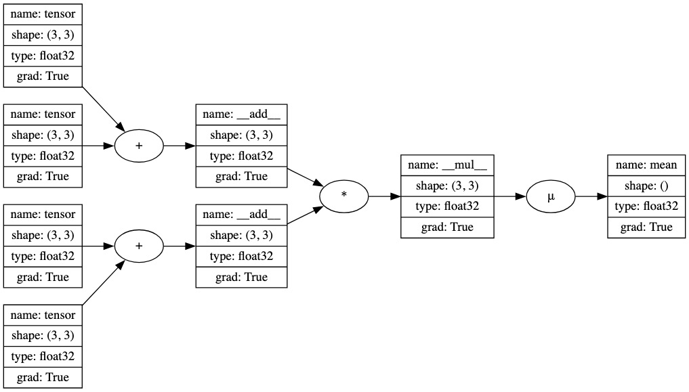

<div align='center'>
<h1> TinyNet using only NumPy </h1>
</div>

<div align='center'>
   
[](https://www.python.org/)
[](https://forthebadge.com)
</div>

TinyNet的构建旨在解释制作人工智能神经网络的所有细节，并仅使用NumPy创建它们，且使用本地缓存来处理模型参数，以支持实时更新模型。

## 功能特性
***TinyNet***当前提供了构建全连接神经网络(***Fully Connected Neural Networks***)的基本构件。
### Layers

### Activations

- reLu
- tanh
- sigmoid

- Fully Connected

### Losses

- Mean Square Error
- Cross Entropy

### Optimizers

- Gradient Descent
- Adam

### Models(cache db based)

- MLP
- DDQN

## TinyNet如何运作
张量(Tensor)在tensor.py文件中的定义本质上是一个值的数组，可以对其执行加法、减法、元素级乘法、点积乘法、激活函数等操作。每个张量都会跟踪生成它的其他张量。随着计算图通过后续操作逐步构建，调用张量的backward()方法会创建一个拓扑排序的张量列表，这些张量出现在它之前。反向遍历这个列表,可以找到最后一个张量相对于之前所有张量的导数。这是微积分中链式法则的应用,在机器学习中称为反向模式自动微分(reverse-mode automatic differentiation)或autodiff。

在神经网络中，特别是在监督式深度学习问题中，反向模式autodiff很有用，因为它允许根据损失函数的负梯度(即梯度下降优化)来调整网络参数。损失函数是在网络前向传播后计算的，它反映了网络的预测值与真实值之间的接近程度。通过找到损失函数相对于每个网络参数的导数，可以通过上下调整参数值来降低损失函数，理想情况下达到零。

### backward() 的Demo

```python
from tinynet import Tensor, draw_dot
# demo of backward() method
a = Tensor([[1.0, 2.0, 3.0],
            [4.0, 5.0, 6.0],
            [7.0, 8.0, 9.0]],requires_grad=True)

b = Tensor([[1.0, 1.0, 1.0],
            [1.0, 1.0, 1.0],
            [1.0, 1.0, 1.0]],requires_grad=True)

c = Tensor([[10., 11., 12.],
            [13., 14., 15.], 
            [16., 17., 18.]],requires_grad=True)

d = Tensor([[-0.5, 0.5, -0.5],
            [0.5, -0.5, 0.5],
            [-0.5, 0.5, -0.5]],requires_grad=True)

e = a + b
f = c + d
g = (e * f).mean()

g.backward()   # find derivatives of g w.r.t all other Tensors 
draw_dot(g)
```



## 研发路线图

- [x] 编写框架；
- [x] Demo 演示；
- [] 优化DDQN性能；
